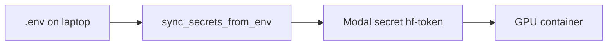

# Secrets

## Use a `.env` file (recommended)

```bash
cd ModalPipeline
cp .env.example .env
# Edit .env and set HF_TOKEN=hf_...
```

`.env` is gitignored. Never commit it.

### What goes in `.env`

| Variable | Required | Purpose |
|----------|----------|---------|
| `HF_TOKEN` | **Yes** | Hugging Face token for model downloads |
| `HUGGING_FACE_HUB_TOKEN` | Recommended | Same value; used by some HF libraries |
| `MODAL_HF_SECRET_NAME` | No (default `hf-token`) | Name of the Modal secret object |
| `SYNC_SECRETS_ON_RUN` | No (default `1`) | Auto-sync `.env` → Modal before `modal run` |

### Sync `.env` → Modal (containers still use Modal secrets)

Modal GPUs do **not** read your laptop `.env`. The runner copies values into a Modal secret:

```bash
python scripts/sync_secrets_from_env.py
# or update existing secret:
python scripts/sync_secrets_from_env.py --force
```

If a run prints `Warning: You are sending unauthenticated requests to the HF Hub`,
run the `--force` command once. That overwrites a stale Modal secret with the
current `.env` values.

Or:

```bash
./scripts/setup_secrets.sh
```

Then run experiments (auto-sync is on by default):

```bash
modal run run_experiment.py --config configs/qwen3_coder_experiment.yaml
```

Disable auto-sync:

```bash
# in .env: SYNC_SECRETS_ON_RUN=0
# or CLI:
modal run run_experiment.py --no-sync-secrets ...
```

---

## Flow



[`app.py`](../app.py) uses `modal.Secret.from_name("hf-token")` (or `MODAL_HF_SECRET_NAME`).

---

## Secrets you need (summary)

| What | Where |
|------|--------|
| Hugging Face token | `.env` → synced to Modal secret `hf-token` |
| Modal account | `modal setup` (not in `.env`) |

**Not required:** `OPENAI_API_KEY`, `ANTHROPIC_API_KEY`, `NVIDIA_API_KEY`.

---

## Manual Modal secret (without `.env`)

```bash
modal secret create hf-token \
  HF_TOKEN=hf_... \
  HUGGING_FACE_HUB_TOKEN=hf_...
```
